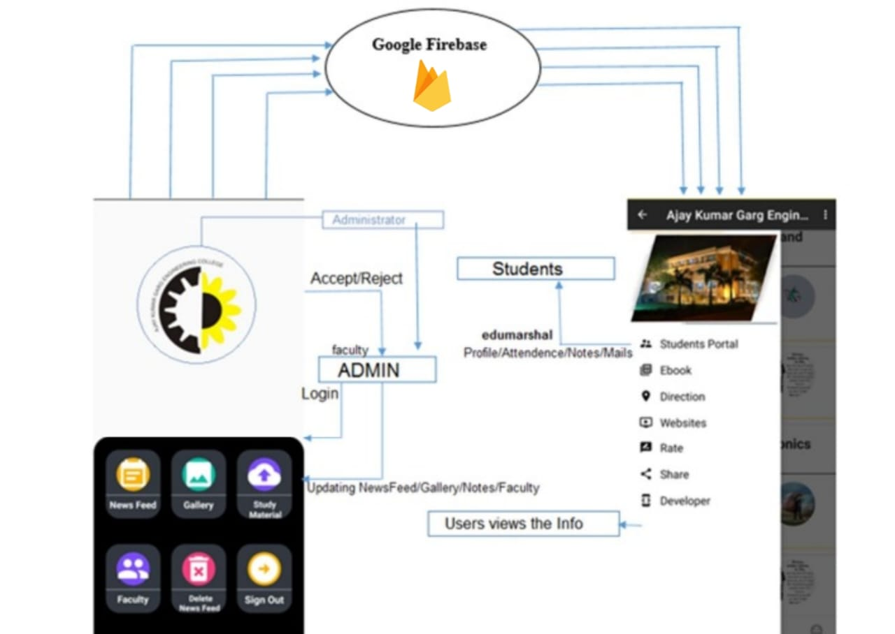
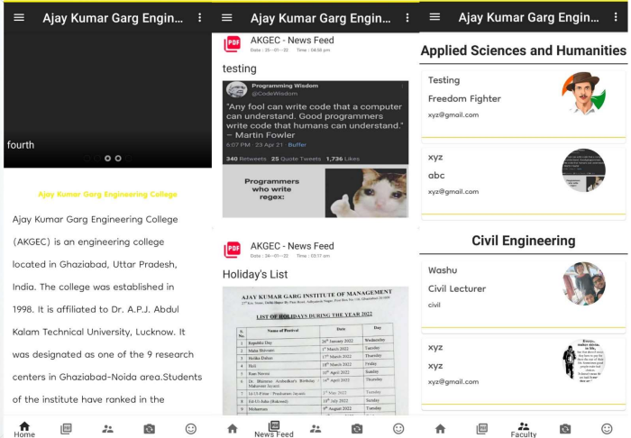
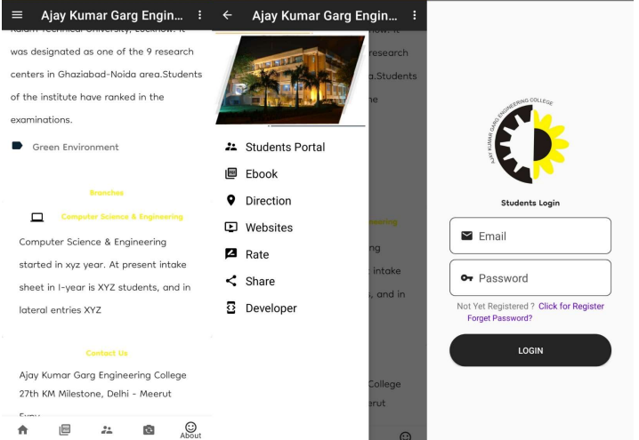

# AKGEC - College Android App for Students/Users

This College Android App only for Students/End-Users developed as an mini project during the third year (Dec, 2022) with real-time updates is a dynamic online platform that provides students, faculty, and staff with the latest information and announcements.

Desing and Working of App:

It offers a central hub for news, events, notices, and other critical updates related to the college's activities and operations. Users can access these updates instantly, ensuring they stay informed about campus happenings and important information in real-time. This feature enhances communication and engagement within the college community, making it an essential tool for effective information dissemination.

# Here are some snaps of Home - NewsFeed and Faculty Layouts

# Here are some snaps of CollegeAbout - DrawerDash and StudentLogin

